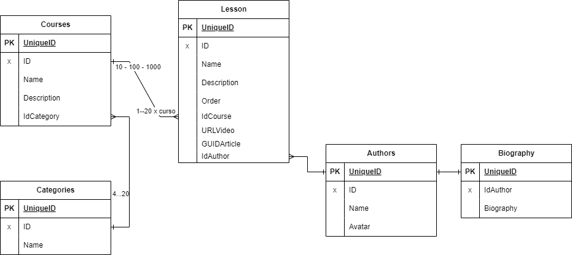

# Laboratorio-Modelado

## Diagrama E-R

Previo al modelado para base de datos documental, generamos el diagrama entidad relacion que usaríamos en bases de datos tabulares.

Esto nos va a permitir revisar las relaciones y su cardinalidad y disponer de una vista global de la estructura de datos

Lo que he tenido en cuenta

- He creado un repositorio
- He embebido información de autores en...
- He usado el subset pattern en...